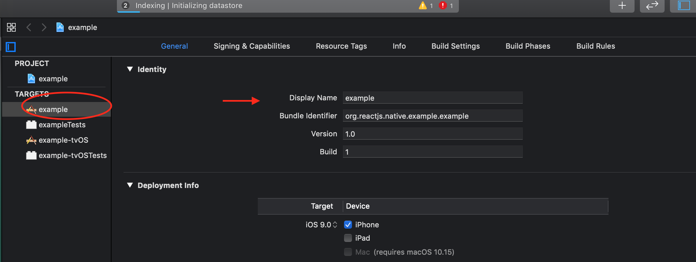

# API

Table of contents

1. [Files](#files)
1. [CLI](#cli)
1. [Javascript](#javascript)
1. [Typescript](#typescript)
1. [ios](#ios)
   1. [Info.plist](#infoplist)
   1. [Objective-C](#objective-c)
1. [Android](#android)
   1. [build.gradle](#buildgradle)
   1. [AndroidManifest.xml](#androidmanifestxml)
   1. [Java](#java)
1. [Note about types](#note-about-types)

## Files

Environment data can be read from both dotenv and yaml files. Latter are automaticlaly detected by CLI based on extension: `.yaml` or `.yml`.

## CLI

Inject environment data with a single command:

| npm                  | yarn             |
| -------------------- | ---------------- |
| `npm yarn rnuc .env` | `yarn rnuc .env` |

## Javascript

Get your values in javascript!

```javascript
// import module
import config from "react-native-ultimate-config";

// access variables
config.MY_CONFIG;
```

## Typescript

`index.d.ts` file is generated according to consumed environment

## ios

### Info.plist

All values from env file are exposed to Build Settings and therefore
automatically available in info plist.

Example: set app name from config

env file:

```env
APP_NAME=example
```

update info plist and observe app name changed:




### Objective-c

```objc
#import <react-native-ultimate-config/ConfigValues.h>
...
NSLog(APP_NAME);
```

## Android

Gradle plugin of a library injects environment variables into as:

1. `BuildConfig` entries
1. stirng resources
1. `project.ext.env` of `build.gradle`

### build.gradle

you can access config variales with simple

```gradle
project.config.get("APP_NAME")
```

### AndroidManifest.xml

All values from environment are made available as resources and [manifest placeholders](https://developer.android.com/studio/build/manifest-build-variables)

They are accessible as:

#### a string resource

```xml
      <activity
        ...
        android:label="@string/APP_NAME"
        />
        ...
      </activity>
```

#### a placeholder variable

```xml
      <activity
        ...
        android:label="${APP_NAME}"
        />
        ...
      </activity>
```

### Java

All variables are exposed via `BuilConfig`. They are accessible as:

```java
package com.example;

import android.os.Bundle;
import android.util.Log;
import com.facebook.react.ReactActivity;

public class MainActivity extends ReactActivity {

  /**
   * Returns the name of the main component registered from JavaScript. This is used to schedule
   * rendering of the component.
   */
  @Override
  protected String getMainComponentName() {
    return "example";
  }

  @Override
  public void onCreate(Bundle savedInstanceState) {
    super.onCreate(savedInstanceState);
    Log.d("onCreate", BuildConfig.APP_NAME);
  }

}

```

## Note about types

If yaml file is used for configuration then it is possible to pick up types of variables, however not every place can deal with all types or deal with types at all. Please consult with the following table to know what's available:

| place               | types available | notes                                                                                                                                                                                    |
| ------------------- | --------------- | ---------------------------------------------------------------------------------------------------------------------------------------------------------------------------------------- |
| javascript          | yes             | -                                                                                                                                                                                        |
| infoplist           | no              | -                                                                                                                                                                                        |
| objective-c         | yes             | -                                                                                                                                                                                        |
| build.gradle        | yes             | -                                                                                                                                                                                        |
| AndroidManifest.xml | yes\*           | floating point values are available as `@string` resources since there are no such type available in resources: https://developer.android.com/guide/topics/resources/available-resources |
| Java                | yes             | -                                                                                                                                                                                        |
