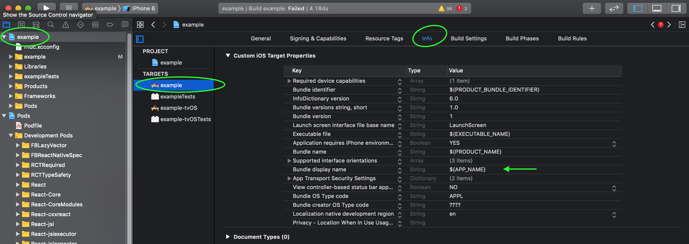
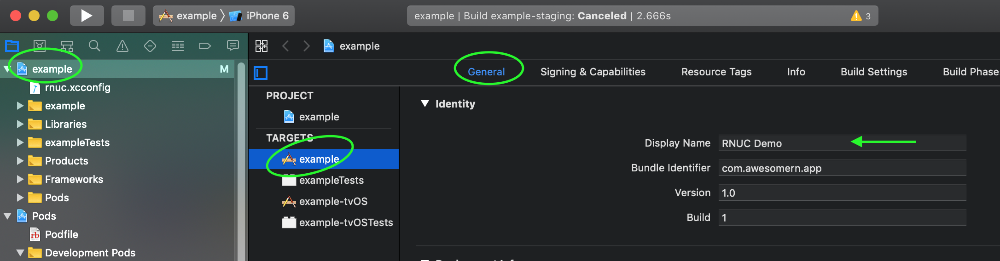
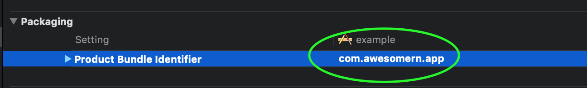
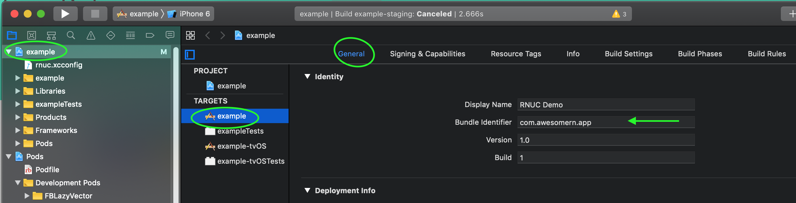
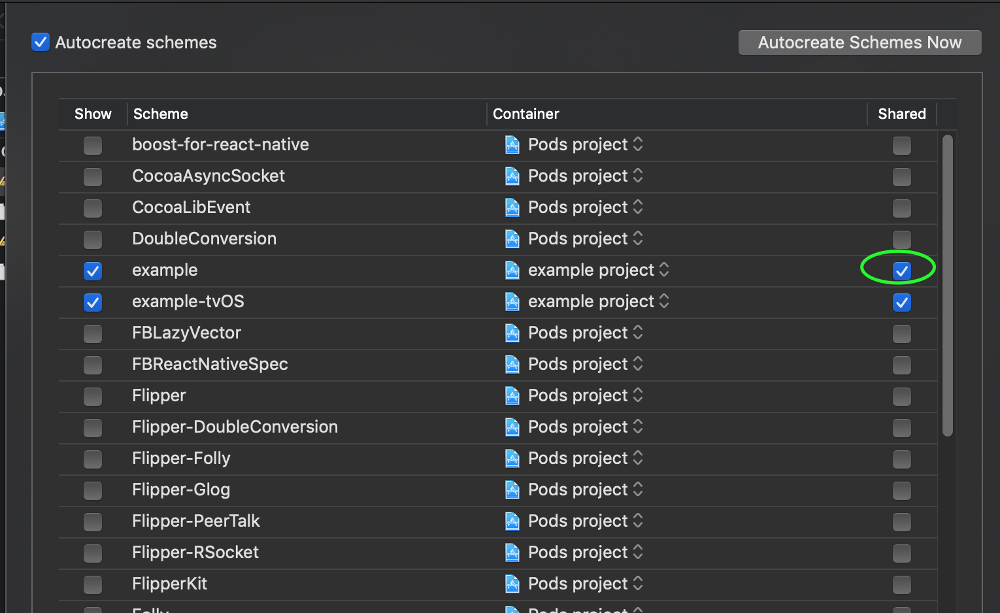

# Cookbook

collection of recipes how `react-native-ultimate-config` can be used for
typical tasks

☝️ _most of the recipes assume default template of react-native app (single target/scheme on ios and no flavors on android) unless stated otherwise_

## Table of contents

1. [Application name](#application-name)
1. [Bundle identifier](#bundle-identifier)
1. [Deeplink](#deeplink)
1. [Using multiple schemes (ios)](#using-multiple-schemes-ios)
1. [Using multiple flavors (android)](#using-multiple-flavors-android)

## Application name

1. Declare env variable `APP_NAME=RNUC Demo`
1. Initialize config `yarn rnuc .env`
1. Configure native projects

### iOS

1. open xcode
1. go to "Info" tab
1. find entry "Bundle Display Name"
1. replace it with `${APP_NAME}`

   

1. checkout app name has changes

   

### Android

1. open `android/app/src/main/AndroidManifest.xml`
1. find tag `application` and set attribute `android:label` to
   `@strings/APP_NAME` or `${APP_NAME}`

   ```xml
    <manifest>
        ...
        <application
            ...
            android:label="@string/APP_NAME"
        </application>
    </manifest>
   ```

   or

   ```xml
   <manifest>
     ...
     <application
         ...
         android:label="${APP_NAME}"
     </application>
   </manifest>
   ```

## Bundle identifier

1. Declare env variable `BUNDLE_ID=com.awesomern.app`
1. Initialize config `yarn rnuc .env`
1. Configure native projects

### ios

1. open xcode
1. go to "Build Settings" tab
1. find entry "PRODUCT_BUNDLE_IDENTIFIER"
   
1. replace it with `${BUNDLE_ID}`

   

1. checkout bunle id has changed
   
   

### Android

1. open `android/app/build.gradle`
1. set bundle id with data from config:

```gradle
android {
    ...
    defaultConfig {
        applicationId project.config.get("BUNDLE_ID")
        ...
    }
}
```

## Deeplink

Suppose you want your app to open links with scheme "awesomeapp://"

1. declare env variable `DEEPLINK_SCHEME=awesomeapp`

### iOS

1. [get familiar with official guide](https://developer.apple.com/documentation/uikit/inter-process_communication/allowing_apps_and_websites_to_link_to_your_content/defining_a_custom_url_scheme_for_your_app)
1. open xcode
1. go to "Info" tab
1. find section "URL Types" and press "+"
1. in "scheme" field type `${DEEPLINK_SCHEME}`


### Android

1. [get familiar with official guide](https://developer.android.com/training/app-links/deep-linking)
1. open `android/app/src/main/AndroidManifest.xml`
1. add intent filter according to the guide and configure scheme using variable:

   ```xml
   <activity>
       ...
       <intent-filter>
           ...
           <data android:scheme="${DEEPLINK_SCHEME}" />
       </intent-filter>
   </activity>
   ```

## Using multiple schemes (ios)

️❗❗❗This recipe has experimental support and may not cover all edge cases

⚠️️⚠️️⚠️️ With this approach xcode project remains uninitialized until you build
it first time. Until project is built some UI elements may dispay empty values (like app name or bundle id)

⚠️️⚠️️⚠️️ While this approach is suitable in certain scenarios make sure
you know exactly why do you need multiple schemes in first place. This library lets you avoid creating unnecessary native schemes/targets in many scenarios.

Using multiple schemes it is possible to avoid using cli tool manually when building specific environment. This is possible by defining pre-build script
phase in a scheme.

1.  open schemes of the project

    

1.  ensure scheme is shared (otherwise it will not be committed)

    

1.  go to scheme details

    

1.  add Script "Pre-action" for "Build" action. ⚠️ make sure to select "Provide build settings from.."
1.  paste the following code

    ```sh
    if [ -d "$HOME/.nvm" ]; then
        export NVM_DIR="$HOME/.nvm"
        [ -s "$NVM_DIR/nvm.sh" ] && \. "$NVM_DIR/nvm.sh" # This loads nvm
    fi

    RN_ROOT_DIR=$(dirname "$PROJECT_DIR")

    cd "$RN_ROOT_DIR"
    yarn run rnuc ".env.yaml"
    #or
    #npm run rnuc ".env.yaml"
    ```

    

1.  you can now duplicate scheme per every environment you use and change name of the file that is used for `rnuc` command.

## Using multiple flavors (android)

️❗❗❗This recipe has experimental support and may not cover all edge cases.
️❗Typescript typings are not available for this setup at the moment.

⚠️️⚠️️⚠️️ While this approach is suitable in certain scenarios make sure
you know exactly why do you need multiple flavors in first place. This library lets you avoid creating unnecessary native flavors in many scenarios.

Assuming you want to support multiple flavors of the app: "dev" and "staging".

1. Define flavor => env mepping in `android/app/build.gradle`

   ```gradle
   project.ext.flavorEnvMapping = [
       dev: "../.env.yaml",
       staging: "../.env.staging.yaml"
   ]
   ```

   ️️⚠️️ only yaml files are supported here

1. Define some flavors (or you may already have them defined)

   ```gradle
    flavorDimensions "default"
    productFlavors {
        dev{
        }
        staging{
        }
    }
   ```

1. Done. Whenever gradle is configuring tasks it will read env data from files
   and populate resources, build config and manifest placeholders from them.
