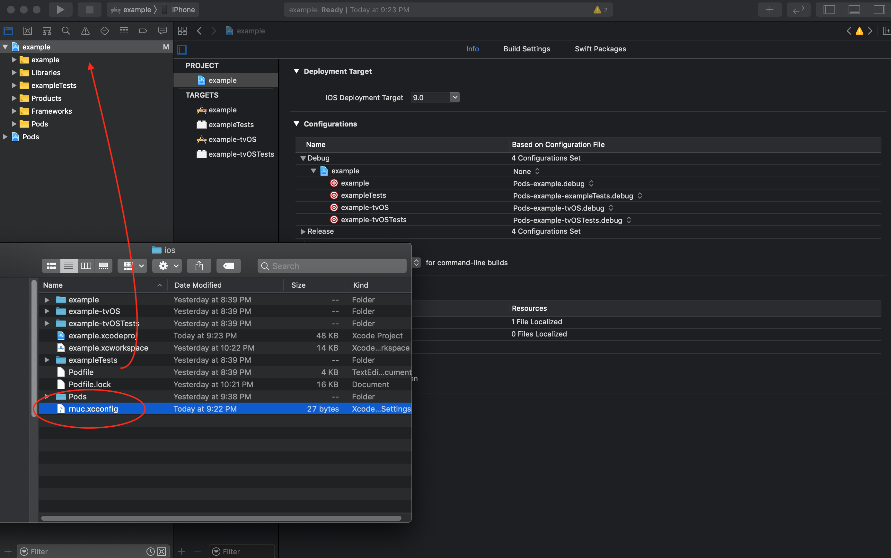
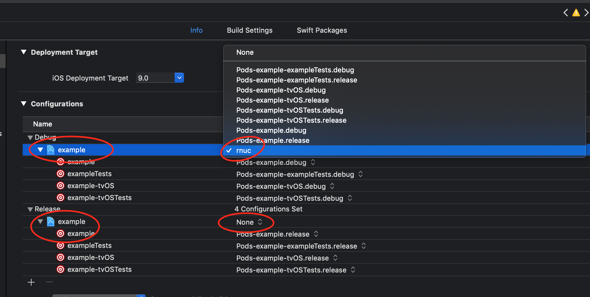

# Quickstart

1. Add dependency

   | npm                                        | yarn                                    |
   | ------------------------------------------ | --------------------------------------- |
   | `npm install react-native-ultimate-config` | `yarn add react-native-ultimate-config` |

1. Create example file

   ```bash
   echo "MY_CONFIG=hello" > .env
   ```

1. Update .gitignore

   Add this to `.gitignore`:

   ```
   # react-native-ultimate-config
   rnuc.xcconfig
   ```

1. **ONLY FOR NPM. SKIP IF USING YARN**

   create script in "package.json"

   ```json
   "rnuc": "$(npm bin)/rnuc"
   ```

1. Generate files

   generate env files for navite projects

   | npm                 | yarn             |
   | ------------------- | ---------------- |
   | `npm run rnuc .env` | `yarn rnuc .env` |

1. Configure navite projects (one-off setup)

   1. ios

      1. open workspace
      1. open Finder in folder `ios`
      1. drag'n'drop generated file into project
         
         
      1. go to project settings
      1. set `rnuc.config` as root configuration for both "Debug" and "Release"
         
         

   1. android

      Add this right after applying react's plugin:

      ```gradle
      apply from: "../../node_modules/react-native-ultimate-config/android/rnuc.gradle"
      ```

      Final code:

      ```gradle
      apply from: "../../node_modules/react-native/react.gradle"
      apply from: "../../node_modules/react-native-ultimate-config/android/rnuc.gradle"
      ```

   1. save changes made to navite projects `.xcodeproj` file and `build.gradle`.
      **DO NOT COMMMIT** `rnuc.*` files.

1. from now on every time you need to switch environment just run
   `npm run rnuc <dotenv file>` or `yarn rnuc <dotenv file>` and rerun native project with
   `react-native run-{ios,android}`
